# Final Fantasy CSS

[](https://cafetechne.github.io/Final-Fantasy-CSS/)
[](CONTRIBUTING.md)
[](#-help-wanted)

A retro-inspired CSS component library for building Final Fantasy-style UI elements. Use it as a standalone stylesheet (no build required) or include from a project build pipeline. Components are prefixed with `ff-` and can be themed by adding a theme class to the document root (e.g., `.theme-ff7`).

> **⚠️ Work in Progress**: This project is in early development. The current themes are **rough approximations** of the original game UIs. We need help from the community to refine these styles to be more authentic to the actual Final Fantasy interfaces!

## 🚨 Help Wanted

**This project needs contributors!** The current implementation provides a basic framework, but the themes need significant refinement to match the authentic Final Fantasy UI aesthetics. If you're a fan of these games and have CSS skills, we'd love your help with:

- **Authentic theme refinement** - Making the themes pixel-perfect to match the original games
- **Missing components** - Adding game-specific UI elements (limit breaks, summon menus, etc.)
- **Animation polish** - Adding authentic transitions and cursor animations
- **Cross-browser testing** - Ensuring compatibility across all browsers
- **Documentation** - Writing better examples and usage guides
- **Accessibility** - Improving keyboard navigation and screen reader support

See our [Contributing Guide](CONTRIBUTING.md) for how to get started!

## Showcase

🎮 **[Try the Live Demo →](https://cafetechne.github.io/Final-Fantasy-CSS/)**

### Theme Previews

| **Final Fantasy VII** | **Final Fantasy I** |
| :---: | :---: |
| 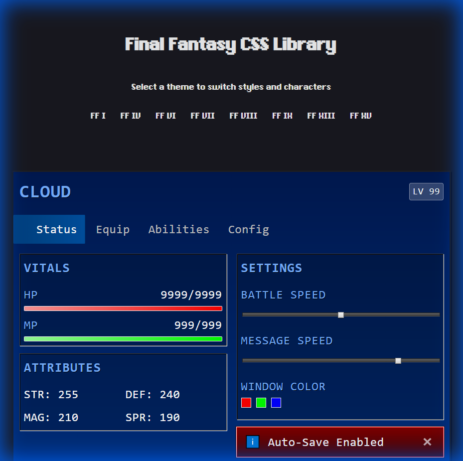 | 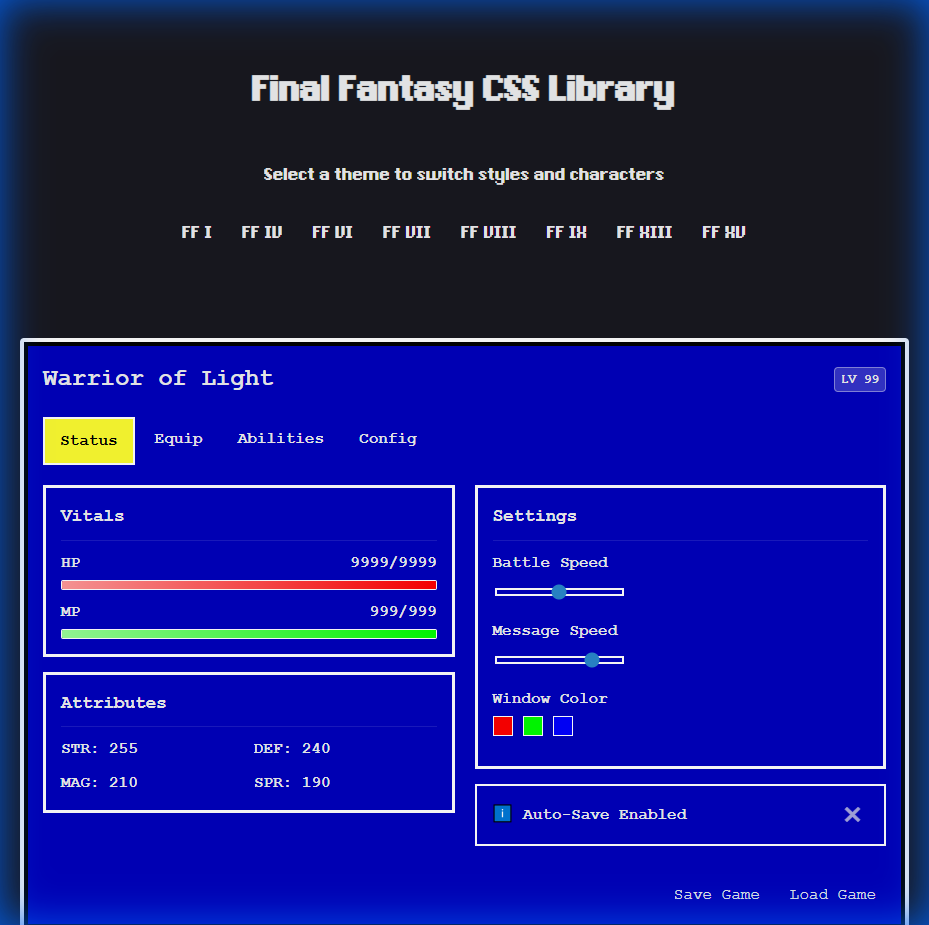 |

| **Final Fantasy VIII** | **Final Fantasy XV** |
| :---: | :---: |
| 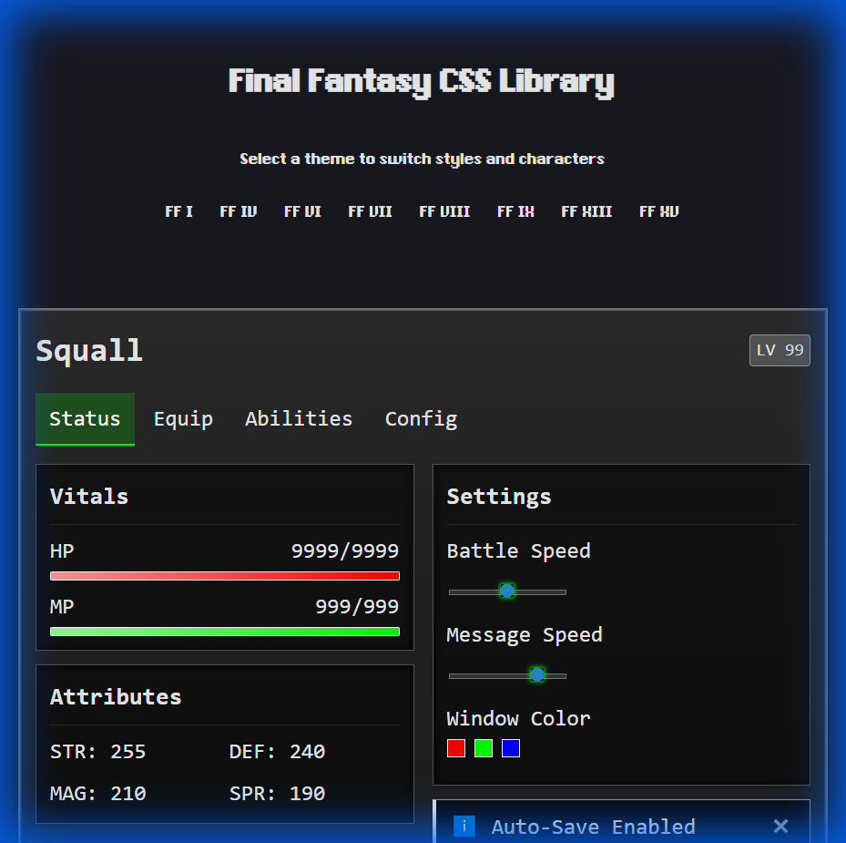 | 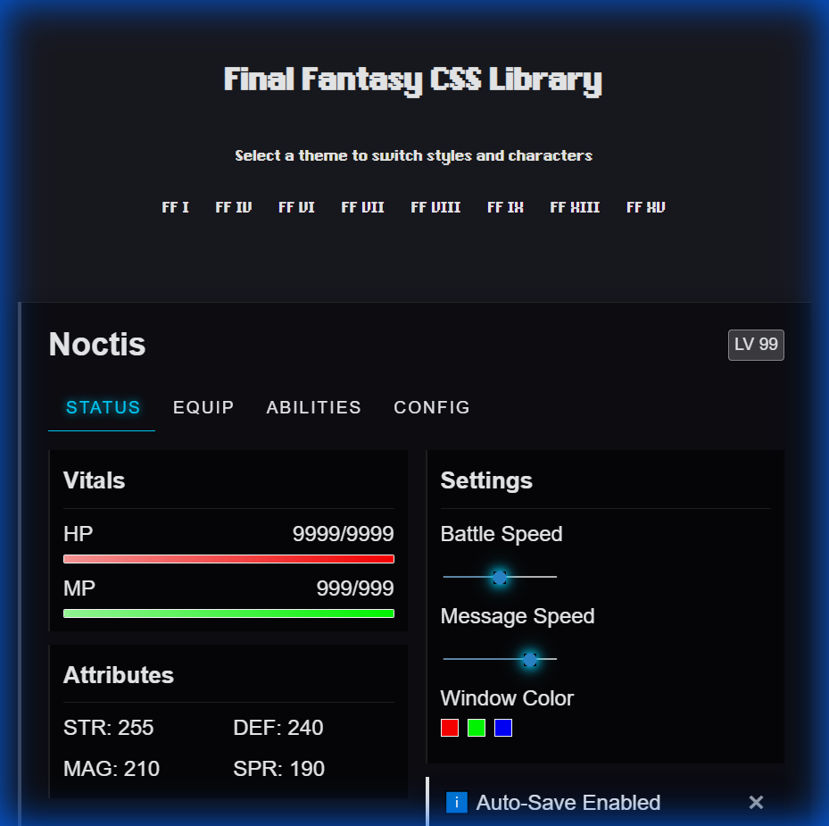 |

### Complete UI Examples

**Final Fantasy VII Theme - All Components**

<details>
<summary>📸 Click to see all FF7 sections</summary>


*Main window with stats and settings*

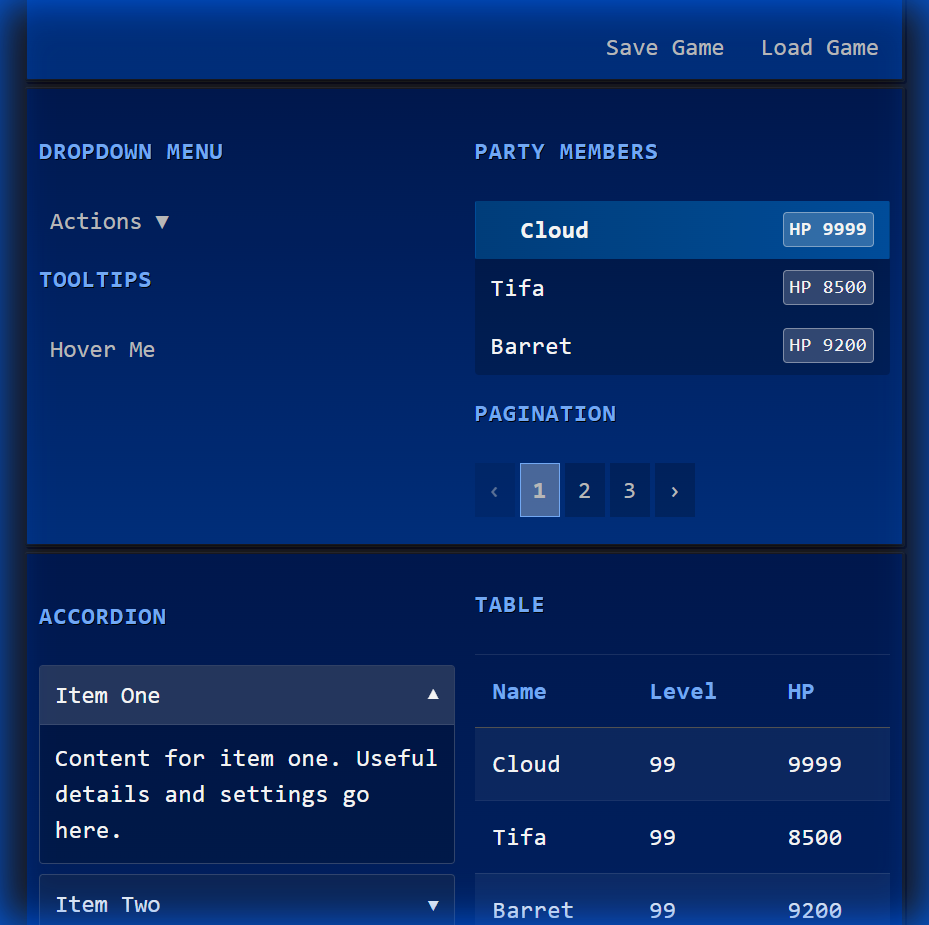
*Dropdowns, tooltips, and party lists*

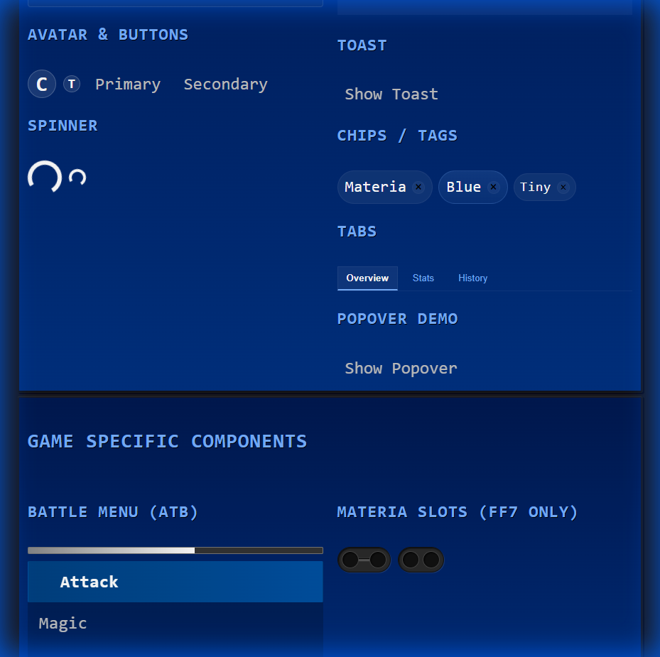
*Game-specific components (Materia, ATB bar)*

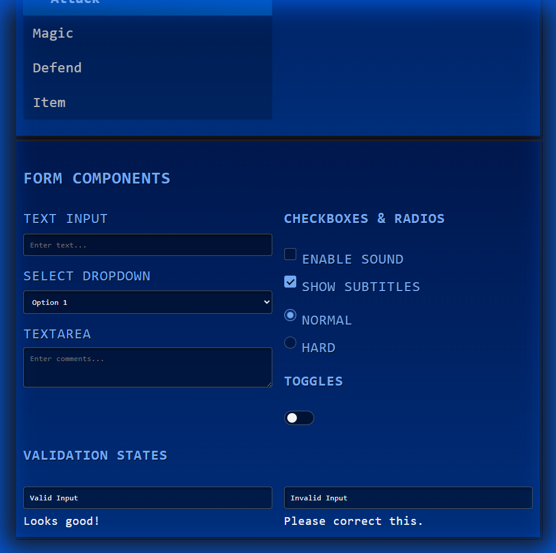
*Form components and validation*

</details>

**Final Fantasy XV Theme - All Components**

<details>
<summary>📸 Click to see all FF15 sections</summary>

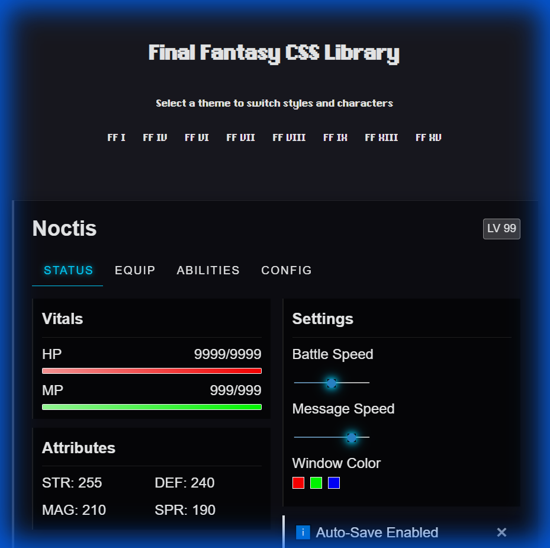
*Main window with stats and settings*

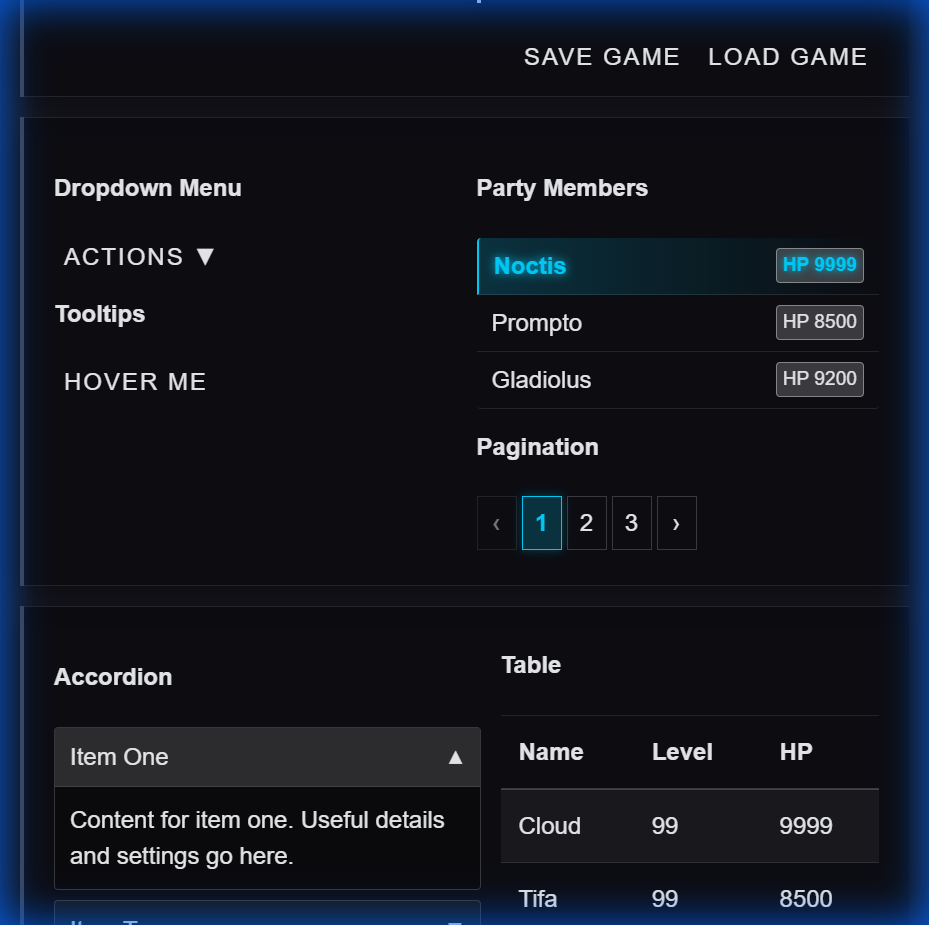
*Dropdowns, tooltips, and party lists*

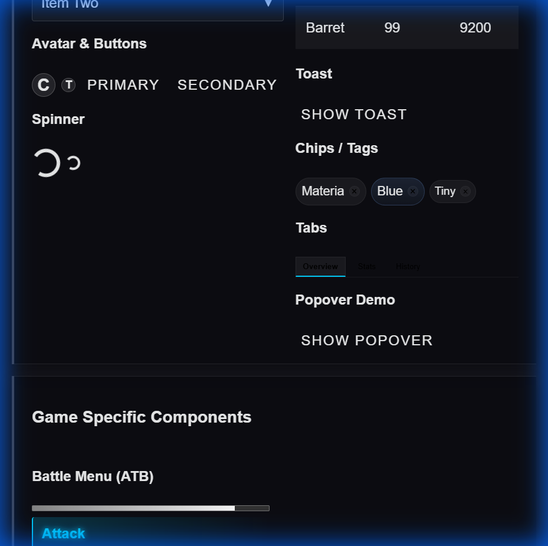
*Game-specific components*

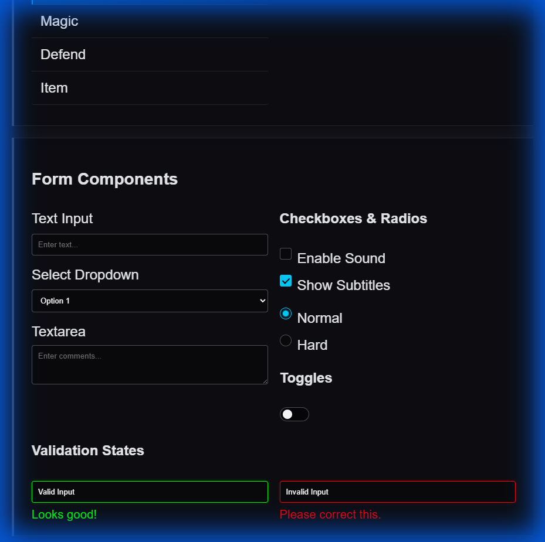
*Form components and validation*

</details>


## Quick Start — No build (plain HTML)

If you don't use npm or a bundler, you can include the stylesheet and the optional JS directly from the repository files.

1. Copy the repo files into your project or reference them locally.
2. Add the stylesheet and JS to your page:

```html
<!-- CSS (this will follow the @import chain in css/final-fantasy.css) -->
<link rel="stylesheet" href="/path/to/Final-Fantasy-CSS/css/final-fantasy.css">

<!-- Optional JS for interactive components (progressive enhancement) -->
<script src="/path/to/Final-Fantasy-CSS/js/ff.js"></script>
```

> **Note:** `css/final-fantasy.css` currently uses `@import` to include component files. Browsers will fetch those imports; for production we recommend using the built `dist/final-fantasy.css` (see Build section) for better performance.

## Quick Start — With npm (build & distribute)

For consumers who use npm or want a single bundled file, we provide PostCSS-based build scripts.

1. Install dependencies:
   ```bash
   npm install
   ```

2. Build the CSS (development):
   ```bash
   npm run build:css
   ```
   This will generate `dist/final-fantasy.css` by inlining imports and running autoprefixer.

3. Build minified CSS for production:
   ```bash
   npm run build:css:min
   ```

## Theming

Apply a theme class to your root element to switch visual themes. Example:

```html
<body class="theme-ff7">
  <!-- page markup -->
</body>
```

Available themes:
- `.theme-ff1` (Final Fantasy I)
- `.theme-ff4` (Final Fantasy IV)
- `.theme-ff6` (Final Fantasy VI)
- `.theme-ff7` (Final Fantasy VII)
- `.theme-ff8` (Final Fantasy VIII)
- `.theme-ff9` (Final Fantasy IX)
- `.theme-ff13` (Final Fantasy XIII)
- `.theme-ff15` (Final Fantasy XV)

## Components (Quick Reference)

- **Buttons**
  ```html
  <button class="ff-btn ff-btn-primary">Primary</button>
  ```

- **Navbar**
  ```html
  <nav class="ff-navbar">
    <div class="ff-navbar-brand">My Project</div>
    <ul class="ff-navbar-nav">
      <li><a href="#">Home</a></li>
    </ul>
  </nav>
  ```

- **Dropdown**
  ```html
  <div class="ff-dropdown" id="demo-dropdown">
    <button class="ff-btn" data-action="toggle-dropdown" data-target="demo-dropdown">Actions</button>
    <ul class="ff-dropdown-menu"> <li><a href="#">One</a></li> </ul>
  </div>
  ```

- **Modal**
  ```html
  <div id="save-modal" class="ff-modal-backdrop">
    <div class="ff-window ff-modal">
      <div class="ff-window-content"> ... </div>
    </div>
  </div>
  <button class="ff-btn" data-action="show-modal" data-modal="save-modal">Open</button>
  ```

## JS API (Lightweight)

The library uses `data-action` attributes for progressive enhancement. Current actions include:

- `data-action="set-theme" data-theme="theme-ff7"` — switch themes
- `data-action="show-modal" data-modal="save-modal"` — show a modal
- `data-action="hide-modal" data-modal="save-modal"` — hide a modal
- `data-action="toggle-dropdown" data-target="demo-dropdown"` — toggle a dropdown

## License & Fonts

- Fonts in `FF6/fonts/` may have licensing restrictions; check `FF6/fonts/readme.txt` before redistribution.
- This project is a fan-made, educational project and is not affiliated with Square Enix.
- Final Fantasy and all other trademarked material is the intellectual property of Square Enix.
